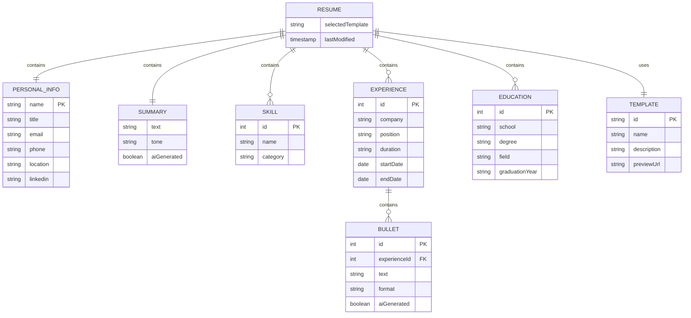
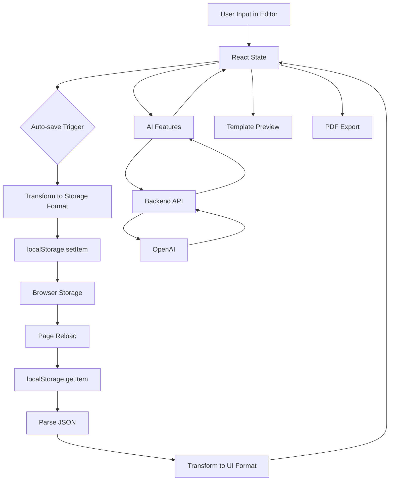

# Entity-Relationship Diagram for AI Resume Builder

## Overview
Even though this application doesn't use a traditional database, it has a well-defined **logical data model** stored in browser localStorage. This ER diagram represents the data structure and relationships.

---

## ER Diagram



---

## Entity Descriptions

### 1. **RESUME** (Root Entity)
**Purpose:** The main container for all resume data  
**Cardinality:** One per user session  
**Storage:** localStorage key: `'resumeData'`  

**Attributes:**
- `selectedTemplate` - Which template is currently selected (professional, classy, simple, stylish)
- `lastModified` - Timestamp of last edit (implicit)

**Relationships:**
- Has exactly ONE `PERSONAL_INFO`
- Has exactly ONE `SUMMARY`
- Has ZERO or MORE `SKILL` entries
- Has ZERO or MORE `EXPERIENCE` entries
- Has ZERO or MORE `EDUCATION` entries
- Uses exactly ONE `TEMPLATE`

---

### 2. **PERSONAL_INFO** (Strong Entity)
**Purpose:** Stores user's contact and identification information  
**Cardinality:** Exactly one per resume  

**Attributes:**
- `name` (Primary Key) - Full name of the candidate
- `title` - Target job role/professional title
- `email` - Contact email address
- `phone` - Contact phone number
- `location` - City, State/Country
- `linkedin` - LinkedIn profile URL

**Constraints:**
- `name` is required (marked with * in UI)
- `title` is required (marked with * in UI)
- All other fields are optional

**Real-world analogy:** Like a business card - contains who you are and how to reach you

---

### 3. **SUMMARY** (Weak Entity)
**Purpose:** Professional summary/objective statement  
**Cardinality:** Exactly one per resume (can be empty string)  

**Attributes:**
- `text` - The actual summary content
- `tone` - Writing tone (professional, casual, etc.)
- `aiGenerated` - Whether it was AI-generated (implicit)

**AI Integration:**
- Can be generated via OpenAI API
- Uses name, title, and skills as input

**Real-world analogy:** Like an elevator pitch - a brief introduction of your professional identity

---

### 4. **SKILL** (Weak Entity)
**Purpose:** Individual skills/technologies the candidate knows  
**Cardinality:** Zero to many per resume  

**Attributes:**
- `id` - Unique identifier (array index)
- `name` - Skill name (e.g., "React", "Python")
- `category` - Skill category (implicit - could be "Frontend", "Backend", etc.)

**Storage Format:**
- Stored as comma-separated string in UI
- Converted to array when saved to localStorage
- Example: `"React, JavaScript, Node.js"` → `["React", "JavaScript", "Node.js"]`

**Real-world analogy:** Like tools in a toolbox - each skill is a separate capability

---

### 5. **EXPERIENCE** (Strong Entity)
**Purpose:** Work history entries  
**Cardinality:** Zero to many per resume  

**Attributes:**
- `id` - Unique identifier (array index)
- `company` - Company/organization name
- `position` - Job title/role
- `duration` - Time period (e.g., "Jan 2023 – Present")
- `startDate` - Start date (implicit, could be extracted from duration)
- `endDate` - End date (implicit, could be extracted from duration)

**Relationships:**
- Has ZERO or MORE `BULLET` points

**AI Integration:**
- Bullets can be AI-generated based on role and company
- Can be converted to STAR format (Situation, Task, Action, Result)

**Real-world analogy:** Like chapters in your career story - each job is a chapter

---

### 6. **BULLET** (Weak Entity)
**Purpose:** Individual achievement/responsibility points under an experience  
**Cardinality:** Zero to many per experience  
**Dependency:** Cannot exist without parent EXPERIENCE  

**Attributes:**
- `id` - Unique identifier (array index within experience)
- `experienceId` - Foreign key to parent experience
- `text` - The bullet point content
- `format` - Format type (normal, STAR)
- `aiGenerated` - Whether it was AI-generated

**AI Features:**
1. **Generate Bullets** - AI creates bullets based on role/company
2. **STAR Format** - Converts existing bullets to STAR format

**Real-world analogy:** Like bullet points in a presentation - specific accomplishments under each job

---

### 7. **EDUCATION** (Strong Entity)
**Purpose:** Educational background entries  
**Cardinality:** Zero to many per resume  

**Attributes:**
- `id` - Unique identifier (array index)
- `school` - School/university name
- `degree` - Degree type (B.Tech, M.S., etc.)
- `field` - Field of study (Computer Science, etc.)
- `graduationYear` - Year of graduation

**Real-world analogy:** Like diplomas on a wall - each degree is a separate credential

---

### 8. **TEMPLATE** (Reference Entity)
**Purpose:** Visual design templates for resume rendering  
**Cardinality:** Four predefined templates  

**Attributes:**
- `id` (Primary Key) - Template identifier
- `name` - Display name
- `description` - Template description
- `previewUrl` - Preview image path

**Available Templates:**
1. **Professional** - Clean, traditional layout
2. **Classy** - Elegant, sophisticated design
3. **Simple** - Minimalist, modern look
4. **Stylish** - Creative, eye-catching design

**Real-world analogy:** Like different frames for the same picture - same content, different presentation

---

## Relationship Details

### RESUME ↔ PERSONAL_INFO (1:1)
- **Type:** One-to-One (Mandatory)
- **Reason:** Every resume must have personal information
- **Implementation:** Nested object in localStorage

### RESUME ↔ SUMMARY (1:1)
- **Type:** One-to-One (Optional - can be empty)
- **Reason:** Every resume has a summary section, but it can be blank
- **Implementation:** String field in localStorage

### RESUME ↔ SKILL (1:N)
- **Type:** One-to-Many (Optional)
- **Reason:** A resume can have multiple skills
- **Implementation:** Array of strings in localStorage

### RESUME ↔ EXPERIENCE (1:N)
- **Type:** One-to-Many (Optional)
- **Reason:** A resume can have multiple work experiences
- **Implementation:** Array of objects in localStorage

### EXPERIENCE ↔ BULLET (1:N)
- **Type:** One-to-Many (Optional)
- **Reason:** Each experience can have multiple bullet points
- **Implementation:** Nested array within experience object

### RESUME ↔ EDUCATION (1:N)
- **Type:** One-to-Many (Optional)
- **Reason:** A resume can have multiple education entries
- **Implementation:** Array of objects in localStorage

### RESUME ↔ TEMPLATE (1:1)
- **Type:** One-to-One (Mandatory)
- **Reason:** Every resume uses exactly one template
- **Implementation:** String reference in localStorage

---

## Data Flow Diagram



---

## Storage Schema (localStorage)

### Key: `'resumeData'`

```json
{
  "personalInfo": {
    "name": "John Doe",
    "title": "Full Stack Developer",
    "email": "john@example.com",
    "phone": "(555) 123-4567",
    "location": "San Francisco, CA",
    "linkedin": "linkedin.com/in/johndoe"
  },
  "summary": "Experienced developer with 5+ years...",
  "skills": ["React", "Node.js", "Python", "AWS"],
  "experience": [
    {
      "company": "Tech Corp",
      "position": "Senior Developer",
      "duration": "Jan 2020 – Present",
      "bullets": [
        "Led team of 5 developers",
        "Increased performance by 40%"
      ]
    }
  ],
  "education": [
    {
      "school": "University of California",
      "degree": "B.S.",
      "field": "Computer Science",
      "graduationYear": "2019"
    }
  ],
  "selectedTemplate": "professional"
}
```

---

## Normalization Analysis

### Current Form: **2NF (Second Normal Form)**

**Why not 3NF?**
- Skills are stored as a flat array (no skill categories)
- Bullets don't have separate metadata (format, AI-generated flag)
- Templates are hardcoded, not stored as data

**Denormalization Trade-offs:**
- ✅ Simpler data structure
- ✅ Faster reads (no joins needed)
- ✅ Easier to serialize/deserialize
- ❌ Some data redundancy
- ❌ No referential integrity

**This is appropriate for:**
- Client-side storage
- Small data volumes
- No concurrent access
- No complex queries

---

## Constraints & Business Rules

### Data Validation Rules:

1. **PERSONAL_INFO**
   - `name` cannot be empty
   - `title` cannot be empty
   - `email` must be valid email format (client-side validation)

2. **EXPERIENCE**
   - Must have at least `company` OR `role` to generate AI bullets
   - Bullets array cannot be null (minimum: empty array)

3. **EDUCATION**
   - All fields are optional
   - At least one field should be filled for the entry to be meaningful

4. **SKILLS**
   - Stored as comma-separated string
   - Trimmed and filtered (empty strings removed)

5. **TEMPLATE**
   - Must be one of: professional, classy, simple, stylish
   - Defaults to 'professional' if invalid

---

## Comparison: With vs Without Database

### Current (localStorage only):

| Aspect | Implementation |
|--------|----------------|
| **Storage** | Browser localStorage |
| **Persistence** | Until cache cleared |
| **Capacity** | ~5-10 MB |
| **Access** | Single device only |
| **Backup** | Manual (export PDF) |
| **Concurrency** | Single user |
| **Security** | Client-side only |

### With Database (MongoDB):

| Aspect | Implementation |
|--------|----------------|
| **Storage** | Cloud database |
| **Persistence** | Permanent |
| **Capacity** | Unlimited |
| **Access** | Multi-device |
| **Backup** | Automatic |
| **Concurrency** | Multi-user |
| **Security** | Server-side auth |

---

## Future Database Schema (If Implemented)

If you were to add MongoDB, here's what the collections would look like:

### Collection: `users`
```javascript
{
  _id: ObjectId,
  email: String,
  passwordHash: String,
  createdAt: Date,
  lastLogin: Date
}
```

### Collection: `resumes`
```javascript
{
  _id: ObjectId,
  userId: ObjectId,  // Foreign key to users
  personalInfo: { ... },
  summary: String,
  skills: [String],
  experience: [ ... ],
  education: [ ... ],
  selectedTemplate: String,
  createdAt: Date,
  updatedAt: Date
}
```

### Collection: `templates`
```javascript
{
  _id: ObjectId,
  name: String,
  description: String,
  isCustom: Boolean,
  userId: ObjectId,  // null for default templates
  cssStyles: String,
  htmlStructure: String
}
```

---

## Key Takeaways

1. **ER diagrams work for ANY data structure** - not just databases
2. **This app has 8 main entities** with clear relationships
3. **Data lives in localStorage** but follows database design principles
4. **Relationships are implemented through nesting** (JSON structure)
5. **No foreign keys** but logical parent-child relationships exist
6. **Denormalized for performance** - appropriate for client-side storage

---

## Visual Summary

**Entity Hierarchy:**
```
RESUME (Root)
├── PERSONAL_INFO (1:1)
├── SUMMARY (1:1)
├── SKILLS (1:N)
├── EXPERIENCE (1:N)
│   └── BULLETS (1:N)
├── EDUCATION (1:N)
└── TEMPLATE (1:1)
```

**Data Lifecycle:**
```
Create → Edit → Auto-save → localStorage → Reload → Restore → Edit → ...
                    ↓
                AI Enhance
                    ↓
                Export PDF
```
