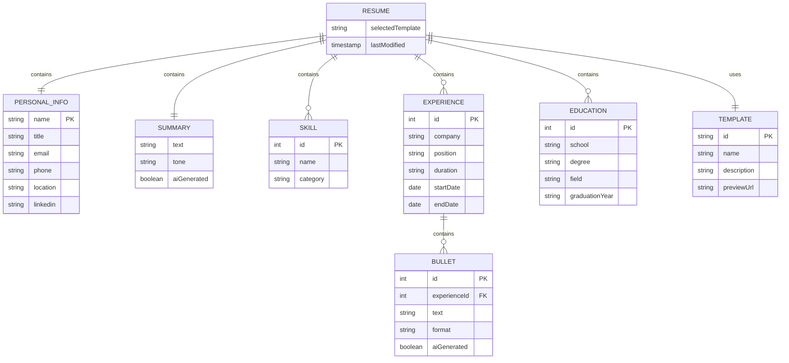
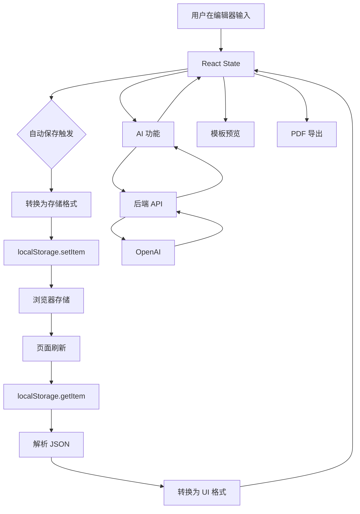

# AI 简历创作助手 - 实体关系图(ER Diagram)

## 概述
本应用虽未使用传统数据库,但拥有一套定义清晰的**逻辑数据模型**,存储于浏览器 localStorage。本 ER 图描述其数据结构与关系。

---

## ER 图



---

## 实体说明

### 1. **RESUME**（根实体）
**用途：** 所有简历数据的主容器
**基数：** 每个用户会话一份
**存储：** localStorage 键：`'resumeData'`（多版本模式下为激活版本的写穿镜像）

**属性：**
- `selectedTemplate` - 当前选中的模板（professional / classy / simple / stylish）
- `lastModified` - 最近编辑时间（隐式）

**关系：**
- 恰好有 1 个 `PERSONAL_INFO`
- 恰好有 1 个 `SUMMARY`
- 有 0 到多个 `SKILL`
- 有 0 到多个 `EXPERIENCE`
- 有 0 到多个 `EDUCATION`
- 使用恰好 1 个 `TEMPLATE`

---

### 2. **PERSONAL_INFO**（强实体）
**用途：** 存储用户的联系方式与身份信息
**基数：** 每份简历恰好 1 个

**属性：**
- `name`（主键）- 求职者姓名
- `title` - 目标职位 / 专业头衔
- `email` - 联系邮箱
- `phone` - 联系电话
- `location` - 城市 / 地区
- `linkedin` - LinkedIn 主页链接

**约束：**
- `name` 必填（界面中标 *）
- `title` 必填（界面中标 *）
- 其余字段均可选

**类比：** 像一张名片 —— 说明你是谁、如何联系你

---

### 3. **SUMMARY**（弱实体）
**用途：** 个人简介 / 求职意向陈述
**基数：** 每份简历恰好 1 个（允许空字符串）

**属性：**
- `text` - 简介正文
- `tone` - 语气风格（professional / casual 等）
- `aiGenerated` - 是否由 AI 生成（隐式）

**AI 集成：**
- 可通过 OpenAI API 生成
- 以姓名、职位、技能作为输入

**类比：** 像一段电梯演讲 —— 对职业身份的简短介绍

---

### 4. **SKILL**（弱实体）
**用途：** 求职者掌握的技能 / 技术
**基数：** 每份简历 0 到多个

**属性：**
- `id` - 唯一标识（数组下标）
- `name` - 技能名（如 "React"、"Python"）
- `category` - 技能分类（隐式，如"前端"、"后端"）

**存储格式：**
- 界面中以逗号分隔字符串呈现
- 保存时转换为数组写入 localStorage
- 示例：`"React, JavaScript, Node.js"` → `["React", "JavaScript", "Node.js"]`

**类比：** 像工具箱里的工具 —— 每项技能都是独立能力

---

### 5. **EXPERIENCE**（强实体）
**用途：** 工作经历条目
**基数：** 每份简历 0 到多个

**属性：**
- `id` - 唯一标识（数组下标）
- `company` - 公司 / 组织名
- `position` - 职位 / 角色
- `duration` - 任职时间（如 "2023.01 - 至今"）
- `startDate` - 开始时间（隐式，可从 duration 解析）
- `endDate` - 结束时间（隐式，可从 duration 解析）

**关系：**
- 有 0 到多个 `BULLET` 要点

**AI 集成：**
- 要点可基于职位与公司由 AI 生成
- 可转换为 STAR 格式（情境、任务、行动、结果）

**类比：** 像职业故事里的章节 —— 每段工作是一章

---

### 6. **BULLET**（弱实体）
**用途：** 工作经历下的具体成就 / 职责要点
**基数：** 每段经历 0 到多个
**依赖：** 必须依附于父级 EXPERIENCE 存在

**属性：**
- `id` - 唯一标识（经历内的数组下标）
- `experienceId` - 指向父级经历的外键
- `text` - 要点内容
- `format` - 格式类型（普通 / STAR）
- `aiGenerated` - 是否由 AI 生成

**AI 功能：**
1. **生成要点** - AI 根据职位/公司生成要点
2. **STAR 结构化** - 把已有要点改写为 STAR 格式

**类比：** 像 PPT 里的要点列表 —— 每段工作下的具体成果

---

### 7. **EDUCATION**（强实体）
**用途：** 教育背景条目
**基数：** 每份简历 0 到多个

**属性：**
- `id` - 唯一标识（数组下标）
- `school` - 学校名
- `degree` - 学历类型（本科、硕士等）
- `field` - 专业（计算机科学等）
- `graduationYear` - 毕业年份

**类比：** 像墙上的证书 —— 每个学位都是一份凭证

---

### 8. **TEMPLATE**（引用实体）
**用途：** 简历渲染的视觉模板
**基数：** 4 套预置模板

**属性：**
- `id`（主键）- 模板标识
- `name` - 展示名
- `description` - 模板描述
- `previewUrl` - 预览图路径

**可用模板：**
1. **Professional（商务双栏）** - 干净的传统双栏布局
2. **Classy（经典居中）** - 优雅精致的设计
3. **Simple（极简单栏）** - 极简现代风格
4. **Stylish（优雅深蓝）** - 有创意、抓眼球的深蓝金色设计

**类比：** 像同一幅画的不同画框 —— 内容相同、呈现不同

---

## 关系详解

### RESUME ↔ PERSONAL_INFO（1:1）
- **类型：** 一对一（强制）
- **原因：** 每份简历必须有个人信息
- **实现：** localStorage 中的嵌套对象

### RESUME ↔ SUMMARY（1:1）
- **类型：** 一对一（可选 - 可为空）
- **原因：** 每份简历都有简介区块，但允许留空
- **实现：** localStorage 中的字符串字段

### RESUME ↔ SKILL（1:N）
- **类型：** 一对多（可选）
- **原因：** 一份简历可以有多个技能
- **实现：** localStorage 中的字符串数组

### RESUME ↔ EXPERIENCE（1:N）
- **类型：** 一对多（可选）
- **原因：** 一份简历可以有多段工作经历
- **实现：** localStorage 中的对象数组

### EXPERIENCE ↔ BULLET（1:N）
- **类型：** 一对多（可选）
- **原因：** 每段经历可以有多个要点
- **实现：** 经历对象内的嵌套数组

### RESUME ↔ EDUCATION（1:N）
- **类型：** 一对多（可选）
- **原因：** 一份简历可以有多条教育背景
- **实现：** localStorage 中的对象数组

### RESUME ↔ TEMPLATE（1:1）
- **类型：** 一对一（强制）
- **原因：** 每份简历恰好使用一个模板
- **实现：** localStorage 中的字符串引用

---

## 数据流图



---

## 存储结构（localStorage）

### 键：`'resumeData'`

```json
{
  "personalInfo": {
    "name": "张三",
    "title": "全栈开发工程师",
    "email": "zhangsan@example.com",
    "phone": "138-0000-0000",
    "location": "天津",
    "linkedin": "linkedin.com/in/zhangsan"
  },
  "summary": "5 年以上经验的开发者……",
  "skills": ["React", "Node.js", "Python", "AWS"],
  "experience": [
    {
      "company": "某科技公司",
      "position": "高级开发工程师",
      "duration": "2020.01 - 至今",
      "bullets": [
        "带领 5 人开发团队",
        "性能提升 40%"
      ]
    }
  ],
  "education": [
    {
      "school": "某某大学",
      "degree": "本科",
      "field": "计算机科学",
      "graduationYear": "2019"
    }
  ],
  "selectedTemplate": "professional"
}
```

### 多版本存储（v1.1 新增）

| 键 | 内容 |
|---|---|
| `resume_versions_v1` | 版本列表 `[{ id, name, createdAt, updatedAt, data }]`，`data` 为上述 ATS 格式简历 |
| `resume_active_v1` | 当前激活版本 id |
| `resumeData` | 兼容旧页面的"写穿"镜像（始终等于激活版本数据） |
| `resumeTheme` | 主题定制 `{ accent, font }`（CSS 变量） |

---

## 范式分析

### 当前形态：**2NF（第二范式）**

**为什么不是 3NF？**
- 技能以扁平数组存储（无技能分类表）
- 要点没有独立元数据（格式、AI 生成标记）
- 模板为硬编码，而非数据化存储

**反范式的取舍：**
- ✅ 数据结构更简单
- ✅ 读取更快（无需 join）
- ✅ 序列化 / 反序列化更容易
- ❌ 存在一定数据冗余
- ❌ 没有引用完整性

**这适用于：**
- 客户端存储
- 小数据量
- 无并发访问
- 无复杂查询

---

## 约束与业务规则

### 数据校验规则：

1. **PERSONAL_INFO**
   - `name` 不能为空
   - `title` 不能为空
   - `email` 需符合邮箱格式（前端校验）

2. **EXPERIENCE**
   - 至少填写 `company` 或 `role` 之一才能生成 AI 要点
   - bullets 数组不可为 null（最小为空数组）

3. **EDUCATION**
   - 所有字段可选
   - 至少填一项，该条目才有意义

4. **SKILLS**
   - 以逗号分隔字符串存储
   - 保存时去除首尾空格并过滤空项

5. **TEMPLATE**
   - 必须是 professional / classy / simple / stylish 之一
   - 非法值回退为 'professional'

6. **导入数据（v1.1 新增）**
   - AI 结构化结果必须通过 Zod 校验，否则整体拒绝
   - 严禁编造原文不存在的字段，缺失留空并生成核对清单

---

## 对比：有无数据库

### 当前（仅 localStorage）：

| 维度 | 实现 |
|--------|----------------|
| **存储** | 浏览器 localStorage |
| **持久性** | 直到清空浏览器缓存 |
| **容量** | 约 5-10 MB |
| **访问** | 仅单设备 |
| **备份** | 手动（导出 PDF/DOCX） |
| **并发** | 单用户 |
| **安全** | 仅客户端 |

### 使用数据库（MongoDB）后：

| 维度 | 实现 |
|--------|----------------|
| **存储** | 云数据库 |
| **持久性** | 永久 |
| **容量** | 无限制 |
| **访问** | 多设备 |
| **备份** | 自动 |
| **并发** | 多用户 |
| **安全** | 服务端认证 |

---

## 未来的数据库设计（如果启用）

如果引入 MongoDB，集合设计如下：

### 集合：`users`
```javascript
{
  _id: ObjectId,
  email: String,
  passwordHash: String,
  createdAt: Date,
  lastLogin: Date
}
```

### 集合：`resumes`
```javascript
{
  _id: ObjectId,
  userId: ObjectId,  // 指向 users 的外键
  personalInfo: { ... },
  summary: String,
  skills: [String],
  experience: [ ... ],
  education: [ ... ],
  selectedTemplate: String,
  createdAt: Date,
  updatedAt: Date
}
```

### 集合：`templates`
```javascript
{
  _id: ObjectId,
  name: String,
  description: String,
  isCustom: Boolean,
  userId: ObjectId,  // 默认模板为 null
  cssStyles: String,
  htmlStructure: String
}
```

---

## 核心要点

1. **ER 图适用于任何数据结构** —— 而不仅仅是数据库
2. **本应用有 8 个主要实体**，关系清晰
3. **数据存于 localStorage**，但遵循数据库设计原则
4. **关系通过嵌套实现**（JSON 结构）
5. **没有物理外键**，但存在逻辑上的父子关系
6. **为性能做了反范式** —— 对客户端存储而言是合理选择

---

## 结构总览

**实体层级：**
```
RESUME（根）
├── PERSONAL_INFO（1:1）
├── SUMMARY（1:1）
├── SKILLS（1:N）
├── EXPERIENCE（1:N）
│   └── BULLETS（1:N）
├── EDUCATION（1:N）
└── TEMPLATE（1:1）
```

**数据生命周期：**
```
创建 → 编辑 → 自动保存 → localStorage → 刷新 → 恢复 → 编辑 → ……
                    ↓
                 AI 增强
                    ↓
                 导出 PDF
```
