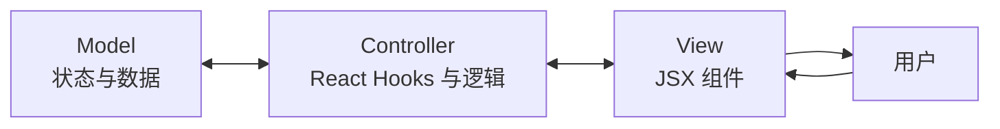
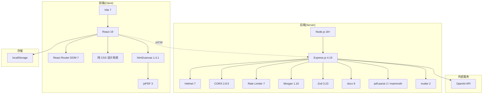
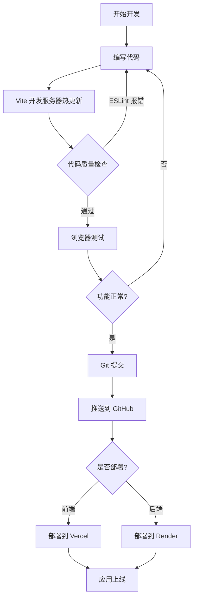
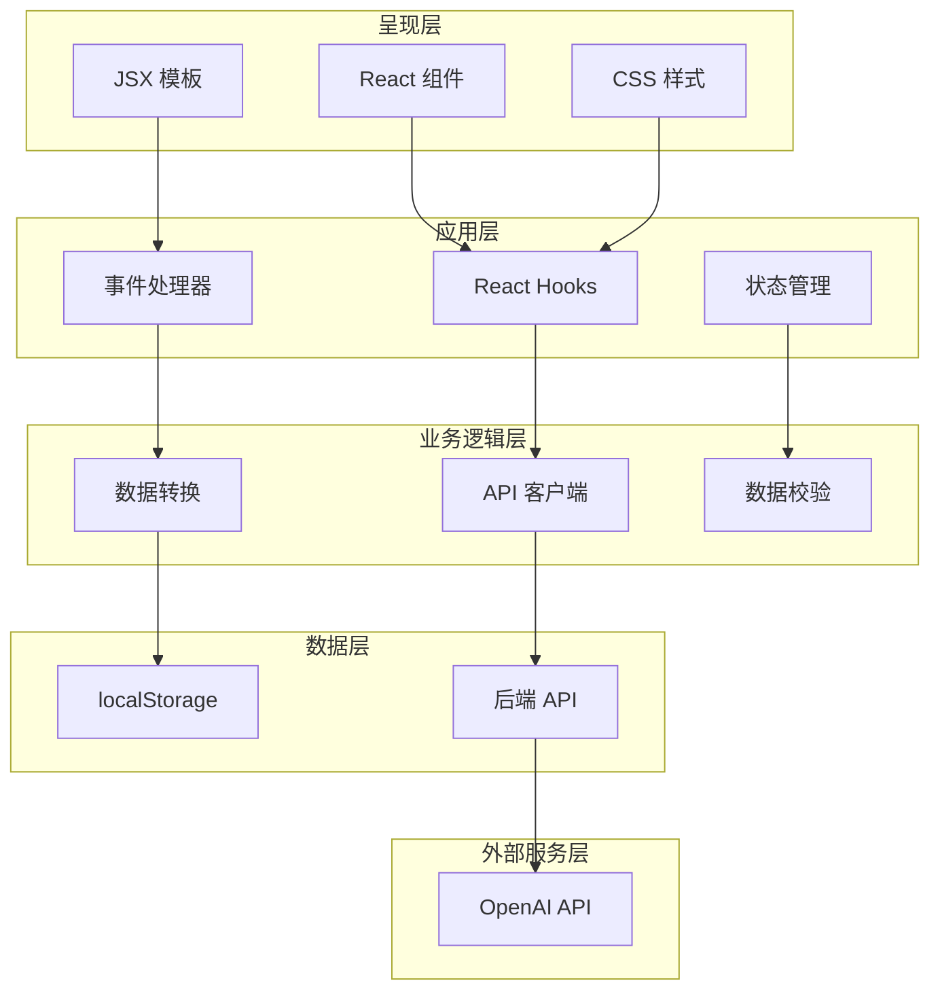

# 项目使用的方法论与框架/工具

## 开发方法论

### 1. 敏捷开发(Agile)

**是什么:** 一种强调灵活性、协作与快速交付的迭代式软件开发方法。

**在本项目中的应用:**
- **增量开发:** 分阶段构建功能(编辑器 → 模板 → AI 功能 → ATS → 模拟面试)
- **持续集成:** 定期提交并测试新功能
- **用户中心设计:** 聚焦用户体验与即时反馈
- **快速应变:** 根据测试结果与需求变化快速调整

**对本项目的价值:**
- ✅ 更快得到可运行原型
- ✅ 易于增改功能
- ✅ 持续改进循环
- ✅ 降低重大失败风险

---

### 2. 基于组件的开发(CBD)

**是什么:** 把 UI 拆解为可复用、相互独立的组件。

**在本项目中的应用:**
- **可复用组件:** Navbar、Footer、模板预览组件
- **模块化页面:** Landing、Editor、Templates、ATS、Interview、Download、Analytics
- **关注点分离:** 每个组件只负责一件事
- **Props 通信:** 数据从父组件单向流向子组件

**组件层级:**
```
App
├── Navbar(布局)
├── 主内容区
│   ├── 落地页
│   ├── 编辑器页
│   │   ├── 表单输入
│   │   └── 模板预览
│   ├── 模板页
│   ├── ATS 诊断页
│   ├── 模拟面试页
│   ├── 导出页
│   └── 数据看板页
└── Footer
```

**价值:**
- ✅ 代码复用
- ✅ 易于维护
- ✅ 独立测试
- ✅ 开发提速

---

### 3. RESTful API 设计

**是什么:** 基于 HTTP 方法设计网络应用的架构风格。

**在本项目中的应用:**

| 接口 | 方法 | 用途 |
|----------|--------|---------|
| `/api/ai/generate-summary` | POST | 生成 AI 个人简介 |
| `/api/ai/generate-bullets` | POST | 生成经历要点 |
| `/api/ai/convert-to-star` | POST | 转换为 STAR 格式 |
| `/api/ai/fill-gaps` | POST | 补充履历空白 |
| `/api/ats/analyze` | POST | ATS 匹配分析 |
| `/api/ats/semantic-match` | POST | 语义级 JD 匹配诊断 |
| `/api/ats/verify-suggestions` | POST | 建议质量校验 |
| `/api/interview/generate` | POST | 生成面试题 |
| `/api/import/parse-resume` | POST | 简历导入解析 |
| `/api/pdf/generate-docx` | POST | 生成 DOCX 文档 |

**采用的 REST 原则:**
- **无状态:** 每个请求自包含全部所需信息
- **客户端-服务器分离:** 前后端相互独立
- **统一接口:** 一致的端点命名与结构
- **JSON 格式:** 标准数据交换格式

---

### 4. MVC 思想的变体架构

**是什么:** 将数据(Model)、呈现(View)、逻辑(Controller)分离。

**在 React 中的适配:**



**对应实现:**
- **Model:** React 状态(`useState`)、localStorage
- **View:** JSX 组件、简历模板
- **Controller:** 事件处理器、API 调用、业务逻辑

---

### 5. 客户端存储模式

**是什么:** 把应用数据存放在浏览器而非服务器数据库。

**在本项目中的实现:**
- **localStorage API:** 浏览器持久化存储
- **自动保存:** 每次变更自动写入
- **JSON 序列化:** 对象转字符串后存储
- **数据恢复:** 页面刷新时加载已存数据

**存储流程:**
```
用户输入 → React State → useEffect Hook → localStorage.setItem() → 浏览器存储
                                                                          ↓
页面刷新 ← React State ← useEffect Hook ← localStorage.getItem() ← 浏览器存储
```

**多版本扩展(v1.1):** 在裸 localStorage 之上抽象出 `resumeStore.js` 版本管理层(版本列表 + 激活指针 + 写穿兼容),使多份简历互不干扰。

---

### 6. API 代理模式

**是什么:** 后端充当前端与外部 API 之间的中介。

**为什么要用它:**
- 🔒 **安全:** 对用户隐藏 OpenAI API Key
- 🛡️ **限流:** 防止 AI 服务被滥用
- 🔄 **请求转换:** 按需格式化发给 OpenAI 的请求
- 📊 **日志:** 跟踪 API 用量与错误

**流程:**
```
前端 → 后端(代理) → OpenAI API
  ↑           ↓              ↓
  └───────────┴──────────────┘
```

---

## 使用的框架与工具

### 前端技术

#### 1. **React(v19)**
- **类型:** 构建用户界面的 JavaScript 库
- **用途:** 整个前端的核心框架
- **用到的主要特性:**
  - Hooks(`useState`、`useEffect`、`useMemo`、`useRef`、`useSearchParams`)
  - 组件组合
  - 条件渲染
  - 事件处理
- **选择理由:** 行业标准、组件化、生态庞大

#### 2. **React Router DOM(v7)**
- **类型:** React 路由库
- **用途:** 处理页面间导航
- **用到的主要特性:**
  - `<Routes>` 与 `<Route>` 组件
  - `useSearchParams` Hook 处理查询参数
  - 客户端路由(无页面刷新)
- **选择理由:** 流畅的 SPA 导航、基于 URL 的状态管理

#### 3. **Vite(v7)**
- **类型:** 构建工具与开发服务器
- **用途:** 快速开发与优化的生产构建
- **用到的主要特性:**
  - 热更新(HMR)
  - 秒级冷启动
  - 优化的生产构建
  - ES Module 支持
- **选择理由:** 比 Webpack 快得多,现代化工具链

#### 4. **纯 CSS 设计系统(无 CSS 框架)**
- **类型:** 自研轻量设计系统
- **用途:** 样式与响应式设计
- **用到的主要特性:**
  - 现代 CSS Grid 与 Flexbox
  - CSS 变量(主题定制:主色调 × 字体族)
  - 媒体查询(移动优先响应式)
- **选择理由:** 不引入 Bootstrap/Tailwind 等重型依赖,包体更小、样式完全可控

---

### 后端技术

#### 5. **Node.js(v18+)**
- **类型:** JavaScript 运行时
- **用途:** 在服务器端运行 JavaScript
- **用到的主要特性:**
  - ES Module
  - async/await
  - Buffer / 文件流处理
- **选择理由:** 与前端同语言、生态庞大

#### 6. **Express.js(v4.19)**
- **类型:** Node.js Web 应用框架
- **用途:** 处理 HTTP 请求与路由
- **用到的主要特性:**
  - 中间件系统
  - 路由处理
  - JSON 解析
  - 错误处理
- **选择理由:** 极简、灵活、广泛采用

#### 7. **OpenAI API(v4 SDK)**
- **类型:** AI/ML API 服务
- **用途:** 生成 AI 内容
- **用到的主要特性:**
  - GPT-4 文本生成
  - Prompt 工程 + JSON mode
  - temperature 控制(结构化抽取用 0.1)
- **选择理由:** 一流的文本生成能力、API 可靠

---

### 工具库

#### 8. **html2canvas(v1.4.1)**
- **类型:** HTML 转图片库
- **用途:** 把简历 HTML 转为 canvas/图片
- **使用方式:** PDF 生成的第一步
- **选择理由:** 客户端渲染,无需服务器参与

#### 9. **jsPDF(v3)**
- **类型:** PDF 生成库
- **用途:** 生成可下载的 PDF 文件
- **使用方式:** 把 canvas 图片写入 PDF
- **选择理由:** 纯 JavaScript,浏览器内运行

#### 10. **docx(v9,v1.1 新增)**
- **类型:** Word 文档生成库
- **用途:** 服务端真实生成 DOCX 文件
- **使用方式:** 按简历数据构建文档结构,Packer.toBuffer 输出二进制流
- **选择理由:** 纯 JS 无需 Office 依赖、支持中文字体

#### 11. **pdf-parse(v2,v1.1 新增)**
- **类型:** PDF 文本提取库
- **用途:** 简历导入时提取 PDF 原文
- **选择理由:** 基于 pdf.js,提取质量稳定

#### 12. **mammoth(v1,v1.1 新增)**
- **类型:** DOCX 文本提取库
- **用途:** 简历导入时提取 Word 原文
- **选择理由:** 轻量、专注文本内容

#### 13. **multer(v2,v1.1 新增)**
- **类型:** 文件上传中间件
- **用途:** 接收导入的简历文件
- **配置:** 内存存储(文件不落盘)+ 5MB 上限 + 文件类型白名单
- **选择理由:** Express 生态标准方案

---

### 安全与性能工具

#### 14. **Helmet(v7)**
- **类型:** Express 安全中间件
- **用途:** 设置安全相关的 HTTP 响应头
- **防御:**
  - XSS 攻击
  - 点击劫持
  - MIME 嗅探
- **选择理由:** Express 安全的行业标准

#### 15. **CORS(v2.8.5)**
- **类型:** 跨源资源共享中间件
- **用途:** 允许前端与后端通信
- **配置:** 域名白名单
- **选择理由:** 前后端分离架构的必备品

#### 16. **express-rate-limit(v7)**
- **类型:** 限流中间件
- **用途:** 防止 API 滥用
- **配置:**
  - 每 IP 每 15 分钟限次
  - 重点保护高成本的 AI 接口
- **选择理由:** 防止 OpenAI API 费用失控

---

### 开发工具

#### 17. **ESLint(v9)**
- **类型:** JavaScript 代码检查工具
- **用途:** 代码质量与风格一致性
- **覆盖规则:**
  - React 最佳实践
  - Hook 依赖
  - 未使用变量
- **选择理由:** 提前发现 Bug、统一规范

#### 18. **dotenv(v16)**
- **类型:** 环境变量管理
- **用途:** 管理配置与密钥
- **使用方式:** 存放 OpenAI API Key、端口号等
- **选择理由:** 密钥不进代码

#### 19. **Morgan(v1.10)**
- **类型:** HTTP 请求日志
- **用途:** 记录所有 API 请求
- **格式:** combined(Apache 风格)
- **选择理由:** 便于调试与监控

#### 20. **Zod(v3.23)**
- **类型:** Schema 校验库
- **用途:** 校验 API 请求与 AI 输出
- **使用方式:** 确保数据类型与格式正确(尤其 AI 结构化抽取结果)
- **选择理由:** 类型安全、错误信息友好

---

## 技术栈图



---

## 开发工作流



---

## 架构分层



---

## 汇总表

| 分类 | 技术 | 版本 | 用途 |
|----------|-----------|---------|---------|
| **前端框架** | React | 19 | UI 组件 |
| **路由** | React Router DOM | 7 | 页面导航 |
| **样式** | 纯 CSS 设计系统 | — | 自研设计系统 + CSS 变量主题 |
| **构建工具** | Vite | 7 | 开发服务器与打包 |
| **PDF 生成** | jsPDF | 3 | 导出简历 |
| **HTML 转图片** | html2canvas | 1.4.1 | 简历截图渲染 |
| **DOCX 生成** | docx | 9 | 服务端生成 Word 文档 |
| **PDF 解析** | pdf-parse | 2 | 简历导入文本提取 |
| **DOCX 解析** | mammoth | 1 | 简历导入文本提取 |
| **文件上传** | multer | 2 | 导入文件接收 |
| **后端运行时** | Node.js | 18+ | 服务器环境 |
| **后端框架** | Express.js | 4.19 | API 服务 |
| **AI 服务** | OpenAI | 4.0 | 内容生成 |
| **安全** | Helmet | 7 | HTTP 响应头 |
| **CORS** | cors | 2.8.5 | 跨源请求 |
| **限流** | express-rate-limit | 7 | API 防护 |
| **日志** | Morgan | 1.10 | 请求日志 |
| **校验** | Zod | 3.23 | Schema 校验 |
| **环境变量** | dotenv | 16.4 | 配置管理 |
| **代码质量** | ESLint | 9 | 代码检查 |
| **存储** | localStorage | 浏览器 API | 客户端数据 |

---

## 为什么选这套技术栈?

### 前端选型:
- **React:** 组件可复用、虚拟 DOM 性能好
- **Vite:** 极快的开发体验
- **纯 CSS:** 零重型依赖、样式完全可控、包体更小
- **客户端 PDF:** 无需服务器处理,导出即所见即所得

### 后端选型:
- **Express:** 轻量,做 API 代理恰到好处
- **Node.js:** 全栈同语言
- **OpenAI:** 当前最佳的 AI 文本生成能力
- **安全中间件:** 生产级防护开箱即用

### 架构选型:
- **SPA(单页应用):** 流畅的用户体验
- **RESTful API:** 标准、可扩展
- **localStorage:** 隐私优先,无需数据库
- **代理模式:** 安全的 API Key 管理
