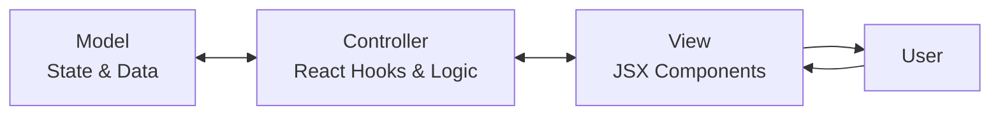
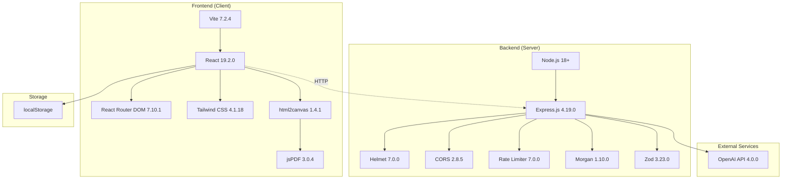
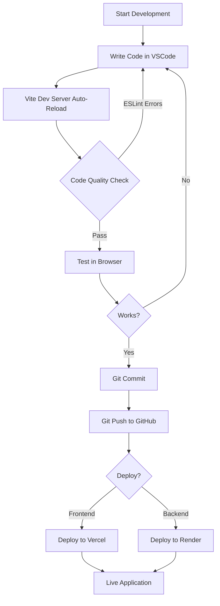
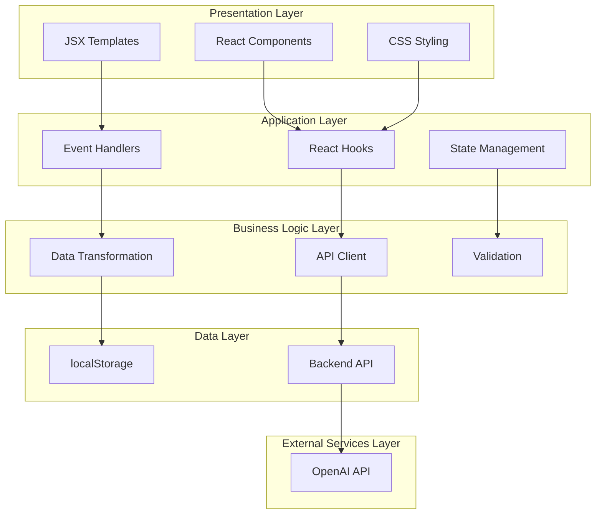

# Methodologies and Frameworks/Tools Used

## Development Methodologies

### 1. Agile Development Methodology

**What it is:** An iterative approach to software development that emphasizes flexibility, collaboration, and rapid delivery.

**How we applied it:**
- **Incremental Development:** Built features in phases (Editor → Templates → AI Features → ATS → Interview)
- **Continuous Integration:** Regular commits and testing of new features
- **User-Centric Design:** Focus on user experience and immediate feedback
- **Adaptability:** Quick changes based on testing and requirements

**Benefits for this project:**
- ✅ Faster time to working prototype
- ✅ Easy to add/modify features
- ✅ Continuous improvement cycle
- ✅ Reduced risk of major failures

---

### 2. Component-Based Development (CBD)

**What it is:** Breaking down the UI into reusable, independent components.

**How we applied it:**
- **Reusable Components:** Navbar, Footer, Template Previews
- **Modular Pages:** Landing, Editor, Templates, ATS, Interview, Download
- **Separation of Concerns:** Each component handles one responsibility
- **Props-Based Communication:** Data flows from parent to child components

**Component Hierarchy:**
```
App
├── Navbar (Layout)
├── Main Content
│   ├── Landing Page
│   ├── Editor Page
│   │   ├── Form Inputs
│   │   └── Template Preview
│   ├── Templates Page
│   ├── ATS Analyzer Page
│   ├── Interview Page
│   └── Download Page
└── Footer
```

**Benefits:**
- ✅ Code reusability
- ✅ Easier maintenance
- ✅ Independent testing
- ✅ Faster development

---

### 3. RESTful API Design

**What it is:** Architectural style for designing networked applications using HTTP methods.

**How we applied it:**

| Endpoint | Method | Purpose |
|----------|--------|---------|
| `/api/resume/summary` | POST | Generate AI summary |
| `/api/resume/bullets` | POST | Generate bullet points |
| `/api/resume/star` | POST | Convert to STAR format |
| `/api/resume/gap` | POST | Fill employment gaps |
| `/api/ats/analyze` | POST | Analyze resume for ATS |
| `/api/interview/generate` | POST | Generate interview questions |

**REST Principles Used:**
- **Stateless:** Each request contains all necessary information
- **Client-Server Separation:** Frontend and backend are independent
- **Uniform Interface:** Consistent endpoint naming and structure
- **JSON Format:** Standard data exchange format

---

### 4. MVC-Inspired Architecture

**What it is:** Separation of data (Model), presentation (View), and logic (Controller).

**How we adapted it for React:**



**Implementation:**
- **Model:** React state (`useState`), localStorage
- **View:** JSX components, templates
- **Controller:** Event handlers, API calls, business logic

---

### 5. Client-Side Storage Pattern

**What it is:** Storing application data in the browser instead of a server database.

**How we implemented it:**
- **localStorage API:** Persistent browser storage
- **Auto-save:** Automatic saving on every change
- **JSON Serialization:** Converting objects to strings for storage
- **Data Recovery:** Loading saved data on page reload

**Storage Flow:**
```
User Input → React State → useEffect Hook → localStorage.setItem() → Browser Storage
                                                                            ↓
Page Reload ← React State ← useEffect Hook ← localStorage.getItem() ← Browser Storage
```

---

### 6. API Proxy Pattern

**What it is:** Backend acts as an intermediary between frontend and external APIs.

**Why we use it:**
- 🔒 **Security:** Hide OpenAI API key from users
- 🛡️ **Rate Limiting:** Prevent abuse of AI services
- 🔄 **Request Transformation:** Format requests for OpenAI
- 📊 **Logging:** Track API usage and errors

**Flow:**
```
Frontend → Backend (Proxy) → OpenAI API
   ↑            ↓                ↓
   └────────────┴────────────────┘
```

---

## Frameworks and Tools Used

### Frontend Technologies

#### 1. **React (v19.2.0)**
- **Type:** JavaScript library for building user interfaces
- **Purpose:** Core framework for the entire frontend
- **Key Features Used:**
  - Hooks (`useState`, `useEffect`, `useMemo`)
  - Component composition
  - Conditional rendering
  - Event handling
- **Why chosen:** Industry standard, component-based, large ecosystem

#### 2. **React Router DOM (v7.10.1)**
- **Type:** Routing library for React
- **Purpose:** Handle navigation between pages
- **Key Features Used:**
  - `<Routes>` and `<Route>` components
  - `useSearchParams` hook for query parameters
  - Client-side routing (no page reloads)
- **Why chosen:** Seamless SPA navigation, URL-based state management

#### 3. **Vite (v7.2.4)**
- **Type:** Build tool and development server
- **Purpose:** Fast development and optimized production builds
- **Key Features Used:**
  - Hot Module Replacement (HMR)
  - Fast cold starts
  - Optimized production builds
  - ES modules support
- **Why chosen:** 10x faster than Webpack, modern tooling

#### 4. **Tailwind CSS (v4.1.18)**
- **Type:** Utility-first CSS framework
- **Purpose:** Styling and responsive design
- **Key Features Used:**
  - Utility classes
  - Responsive breakpoints
  - Custom color schemes
  - Component styling
- **Why chosen:** Rapid styling, consistent design, small bundle size

---

### Backend Technologies

#### 5. **Node.js (v18+)**
- **Type:** JavaScript runtime environment
- **Purpose:** Run JavaScript on the server
- **Key Features Used:**
  - ES6 modules
  - Async/await
  - File system operations
- **Why chosen:** Same language as frontend, large ecosystem

#### 6. **Express.js (v4.19.0)**
- **Type:** Web application framework for Node.js
- **Purpose:** Handle HTTP requests and routing
- **Key Features Used:**
  - Middleware system
  - Route handling
  - JSON parsing
  - Error handling
- **Why chosen:** Minimalist, flexible, widely adopted

#### 7. **OpenAI API (v4.0.0)**
- **Type:** AI/ML API service
- **Purpose:** Generate AI-powered content
- **Key Features Used:**
  - GPT-4 text generation
  - Prompt engineering
  - Streaming responses
- **Why chosen:** Best-in-class language model, reliable API

---

### Utility Libraries

#### 8. **html2canvas (v1.4.1)**
- **Type:** HTML to image conversion library
- **Purpose:** Convert resume HTML to canvas/image
- **How used:** First step in PDF generation
- **Why chosen:** Client-side rendering, no server needed

#### 9. **jsPDF (v3.0.4)**
- **Type:** PDF generation library
- **Purpose:** Create downloadable PDF files
- **How used:** Convert canvas images to PDF
- **Why chosen:** Pure JavaScript, works in browser

---

### Security & Performance Tools

#### 10. **Helmet (v7.0.0)**
- **Type:** Security middleware for Express
- **Purpose:** Set security-related HTTP headers
- **Protection against:**
  - XSS attacks
  - Clickjacking
  - MIME sniffing
- **Why chosen:** Industry standard for Express security

#### 11. **CORS (v2.8.5)**
- **Type:** Cross-Origin Resource Sharing middleware
- **Purpose:** Allow frontend to communicate with backend
- **Configuration:** Whitelist specific origins
- **Why chosen:** Essential for separate frontend/backend

#### 12. **express-rate-limit (v7.0.0)**
- **Type:** Rate limiting middleware
- **Purpose:** Prevent API abuse
- **Configuration:**
  - 10 requests per 15 minutes per IP
  - Protects expensive AI endpoints
- **Why chosen:** Prevent cost overruns from OpenAI API

---

### Development Tools

#### 13. **ESLint (v9.39.1)**
- **Type:** JavaScript linter
- **Purpose:** Code quality and consistency
- **Rules enforced:**
  - React best practices
  - Hook dependencies
  - Unused variables
- **Why chosen:** Catch bugs early, enforce standards

#### 14. **dotenv (v16.4.0)**
- **Type:** Environment variable manager
- **Purpose:** Manage configuration and secrets
- **Usage:** Store OpenAI API key, port numbers
- **Why chosen:** Keep secrets out of code

#### 15. **Morgan (v1.10.0)**
- **Type:** HTTP request logger
- **Purpose:** Log all API requests
- **Format:** Combined (Apache-style) logs
- **Why chosen:** Debugging and monitoring

#### 16. **Zod (v3.23.0)**
- **Type:** TypeScript-first schema validation
- **Purpose:** Validate API request payloads
- **Usage:** Ensure correct data types and formats
- **Why chosen:** Type-safe validation, great error messages

---

## Technology Stack Diagram



---

## Development Workflow Diagram



---

## Architecture Layers



---

## Summary Table

| Category | Technology | Version | Purpose |
|----------|-----------|---------|---------|
| **Frontend Framework** | React | 19.2.0 | UI components |
| **Routing** | React Router DOM | 7.10.1 | Navigation |
| **Styling** | Tailwind CSS | 4.1.18 | Design system |
| **Build Tool** | Vite | 7.2.4 | Dev server & bundling |
| **PDF Generation** | jsPDF | 3.0.4 | Export resumes |
| **HTML to Image** | html2canvas | 1.4.1 | Screenshot resumes |
| **Backend Runtime** | Node.js | 18+ | Server environment |
| **Backend Framework** | Express.js | 4.19.0 | API server |
| **AI Service** | OpenAI | 4.0.0 | Content generation |
| **Security** | Helmet | 7.0.0 | HTTP headers |
| **CORS** | cors | 2.8.5 | Cross-origin requests |
| **Rate Limiting** | express-rate-limit | 7.0.0 | API protection |
| **Logging** | Morgan | 1.10.0 | Request logs |
| **Validation** | Zod | 3.23.0 | Schema validation |
| **Environment** | dotenv | 16.4.0 | Config management |
| **Code Quality** | ESLint | 9.39.1 | Linting |
| **Storage** | localStorage | Browser API | Client-side data |

---

## Why This Stack?

### Frontend Choices:
- **React:** Component reusability, virtual DOM performance
- **Vite:** Lightning-fast development experience
- **Tailwind:** Rapid styling without CSS files
- **Client-side PDF:** No server processing needed

### Backend Choices:
- **Express:** Lightweight, perfect for API proxy
- **Node.js:** JavaScript everywhere (same language)
- **OpenAI:** Best AI text generation available
- **Security middleware:** Production-ready protection

### Architecture Choices:
- **SPA (Single Page App):** Smooth user experience
- **RESTful API:** Standard, scalable design
- **localStorage:** Privacy-first, no database needed
- **Proxy pattern:** Secure API key management
